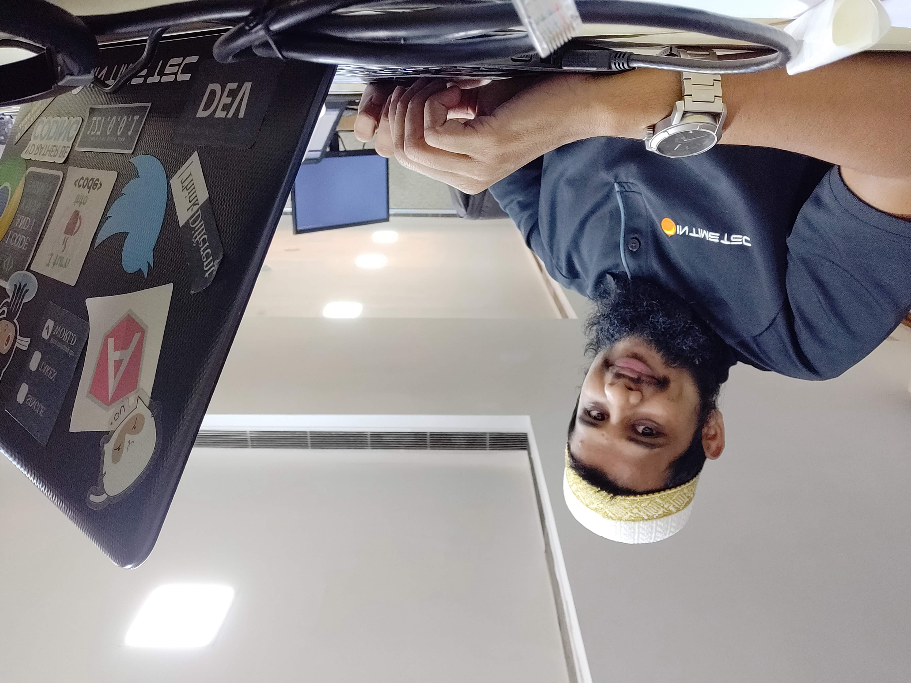

I’m Mustafa Masvi a 26-year-old software developer with a great passion for coding. 
I code and study computer science intensively, mentor new developers, write technical content, and share my passion for programming to over 1k people on social media, in order to show how amazing coding can be!

Although I’ll always make content without expecting any profit, donations massively help me to continue sharing resources for free. 
If you like my content or want to support free coding content, you can donate [here](https://paypal.me/mustafamasvi) through PayPal ♥