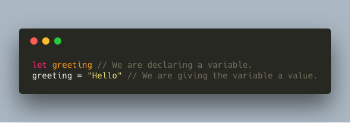
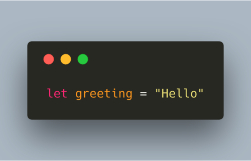
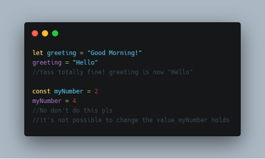

One of the most important things in programming is being able to store values in some sort of containers. In order to do this, we use variables. In JavaScript, you can declare a variable with 3 different keywords: var, let and const. We’ll go over the differences later, but let’s first see a simple example of how to use a variable!
When we give our variable a value, we’re doing two things: first we’re declaring the variable, and then we’re defining the variable by giving it a value. 

Normally, you wouldn’t  take these two steps. You’d simply type:

We just initialized a variable called greeting, that holds the value of “Hello”!  Like I said before, we can use three different keywords in JavaScript in order to declare variables. The differences between them will make a lot more sense once we get to Scope, so let’s just wait a little bit to not get too overwhelmed! However, an easy difference between var, let and const, is that you can change the value of variables declared with var and let, whereas a variable declared with const is “constant”: you can’t change the value. This would look like:

Let’s get started with the next section Primitive Data Types to see what kind of values variables can hold, and some nice tricky stuff that might happen when using variables called coercion.
