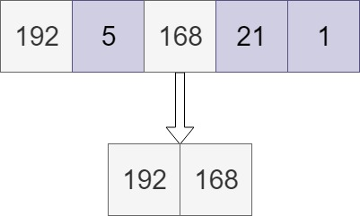
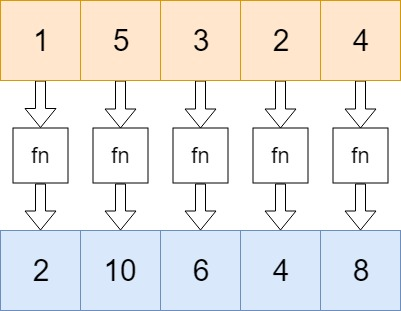
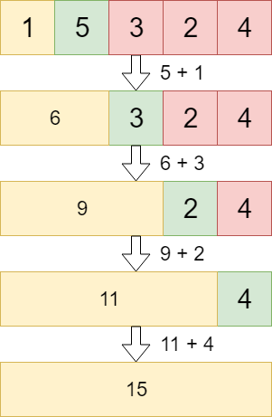
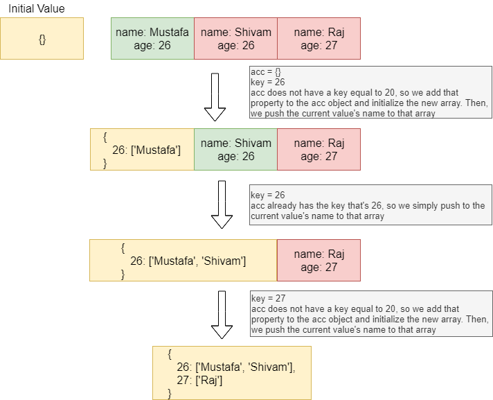

With array methods and properties, we can manipulate, add, remove, or loop over elements in an array.

There are few prototypes funtions provided

---

## .concat()

Joins two arrays, and returns a copy of the joined arrays.

```javascript
const numbers = [192, 168, 5, 21, 1]

const newNumbers = [5, 8]
numbers.concat(newNumbers)
// [192, 168, 5, 21, 1, 5, 8]
```
***

## .every()

Checks if every element in an array returns true for a certain condition. Only if the condition returns true for every element in the array, true gets returned.

```javascript
const numbers = [192, 168, 5, 21, 1]
numbers.every(x => x > 2) // false
numbers.every(x => x > 0) // true
numbers.every(x => x < 200) // true
```
***

## .fill()

Modifies the original array and fills it with a static value.

```javascript
const numbers = [192, 168, 5, 21, 1]
numbers.fill(0) // [0, 0, 0, 0, 0]
```
***

## .filter()

Creates a new array with all the values for which the condition returns true.

```javascript
const numbers = [192, 5, 168, 21, 1]
var highValues = numbers.filter(x => x > 70) 
// highValues is [192, 168]
```


***

## .find()
Returns the first value for which the condition returns true.

```javascript
const numbers = [192, 5, 168, 21, 1]
numbers.find(x => x > 70)  // 192
```
***

## .findIndex()

Returns the index of the first element for which the condition returns true.

```javascript
const numbers = [192, 5, 168, 21, 1]
numbers.findIndex(x => x > 70)  // 0
```
***

## .forEach()
Calls a function for each element in an array.

```javascript
const numbers = [1, 2, 3]
numbers.forEach(x => x * 2)
// 2
// 4
// 6
```
***

## .indexOf()
Returns the index of the element in the array you’ve specified.

```javascript
const numbers = [192, 5, 168, 21, 1]
numbers.indexOf(21)  // 3
```
***

## Array.isArray()
Array.isArray() checks whether the passed parameter is an array or not.

```javascript
const numbers = [192, 5, 168, 21, 1]
const age = 26
const name = 'Mustafa'

Array.isArray(numbers)  
// true. numbers is an array.
Array.isArray(age) 
// false, age is a number, not a array
Array.isArray(name) 
// false, name is a string, not a array
```
***

## .join()
Returns a string of the elements in the array, separated by an optional argument given by you. By default, the elements just get returned in the form of a string. By passing an argument, you can specify how you want the numbers to be separated when they get returned as a string.

```javascript
const numbers = [1, 2, 3]
numbers.join() // "1,2,3"
numbers.join('') // "123"
numbers.join(' ') // "1 2 3"
numbers.join('-') // "1-2-3"
numbers.join(9) // "192939"
```

## .lastIndexOf()
Returns the last index of the element you passed as argument. If no element was found, -1 gets returned.

```javascript
const numbers = [5, 192, 5, 1, 168, 21, 1]
numbers.lastIndexOf(1)  // 6
numbers.lastIndexOf(5)  // 2
numbers.lastIndexOf(8)  // -1
```
***

## .map()
Creates a new array based on the function that’s passed as argument.

```javascript
const numbers = [1, 5, 3, 2, 4]
const newNumbers = numbers.map(x => x * 2);
// [2, 10, 6, 4, 8]

const helloList = numbers.map(() => 'Hello'));
// ["Hello", "Hello", "Hello", "Hello", "Hello]

const smallOrBig = numbers.map(x => {
    return (x <= 2) ? 'small' : 'big'
});
// ["small", "big", "big", "small", 'big']
```



***

## .pop()
Removes the last element of an array, and returns that element. It modifies the original array! 

```javascript
const numbers = [1, 5, 3, 2]
numbers.pop()  // 2
// numbers is now [1, 5, 3]
```
***

## .push()
Adds a new element to the end of an array. If you define a variable with the .push method, this variable will get the value of the length of the new array! 

```javascript
const numbers = [1, 5, 3, 2];
numbers.push(5);
// [1, 5, 3, 2, 5]

const alphabet = ['a', 'b'];
const newLength = alphabet.push('c');
// newLength is 3
// alphabet is ['a', 'b', 'c']
```

***

## .reduce()
Reduce the values of the elements of an array to a single value (going left-to-right). The reduce method receives at least two arguments: the **accumulator** and the **current** value. When we go over the array, we basically collect the values of each element, and do something with them. The accumulator is the **“accumulated”** value of the elements so far, the current value is the value that’s currently the active element in the array as we’re walking over it. 

Let’s say that we simply want to add both values together, and in the end return the value of all elements summed up.

```javascript
const numbers = [1, 5, 3, 2, 4];
numbers.reduce((acc,cur) => acc + cur); //15
```

Green: current value. Orange: accumulator



Although we are just adding the two values in this example, you can do anything based on the value of the accumulator and current value. The reduce method actually receives two arguments: the callback function, and an optional initial value. In the example above, we didn’t provide an initial value, thus the reduce method started at index 1. The accumulator was equal to the element on index 0.

However, if we add an initial value, the reduce method will start at index 0 and take the initial value as the first accumulator. Example: 

```javascript
const numbers = [1, 5, 3, 2, 4];
numbers.reduce((acc,cur) => acc + cur, 100); //115
```
Although the reduced value of the elements in the array is 46, the initial value of 100 got added too. 

Like stated before, you can do anything with the accumulator and the current value. Let’s say that we have an array of objects instead.  In this case, you must provide an initial value. 

```javascript
const people = [
    { name: 'Mustafa', age: 26 },
    { name: 'Shivam', age: 26 },
    { name: 'Raj', age: 27 }
]

people.reduce((acc, cur) => {
    const key = cur.age
    if(!acc[key]) {
        acc[key] = []
    }
    acc[key].push(cur.name)
    return acc
}, {})

// {
//     26: ['Mustafa', 'Shivam'],
//     27: ['Raj']
// }
```



***

## .reverse()
Returns the array, reversed.

```javascript
const numbers = [1, 2, 3, 4]
numbers.reverse(); //[4, 3, 2, 1]
```

## .shift()
The shift method removes the first element of an array, and returns that value. It modifies the original array!

```javascript
const numbers = [2, 3, 1, 2, 3]
const firstNumber = numbers.shift()
// numbers is [3, 1, 2, 3]
//firstNumber is 2
```
***

## .slice()
Selects a part of an array based on the passed arguments, and returns a new array.

The method receives two arguments: the first one is the index of the value in the original array where the new array should start, and the second one is the index of the value where the new array should end, + 1. If we want the new array to contain the values that are on index 1 and 2 in the original array, we would pass 1 and 3 as arguments.

```javascript
const numbers = [2, 3, 1, 2, 3] 
numbers.slice(1,3) // [3, 1]
```
***

## .some()
Checks if at least one element in the array passes the condition.

```javascript
const numbers = [2, 3, 1, 2, 3] 
numbers.some(x => x > 2) // true
numbers.some(x => x > 10) // false
```
***
## .sort()

Sorts the elements of an array. By default, elements are sorted numerically (low-high) or alphabetically (A-Z), however it is possible to add your own logic.

```javascript
const numbers = [2, 8, 1, 7, 3]
const animals = ['zebra', 'dog', 'horse', 'lion'] 
numbers.sort() // [1, 2, 3, 7, 8]
animals.sort() // ["dog", "horse", "lion", "zebra"]

const highToLow = (a, b) => b - a
const lowToHigh = (a, b) => a - b

numbers.sort(highToLow); // [8, 7, 3, 2, 1]
numbers.sort(lowToHigh); // [1, 2, 3, 7, 8]
```

## .splice()
With the splice method, you can either add or remove values from an array, based on whether the second argument is higher than 0 or not. If the second argument is 0, it means that you want to remove 0 items, and only want to add new ones. Otherwise, it indicates the amount of items you want to remove. 
The splice method itself returns an array with the element(s) you want. 

```javascript 
const colors = ['greeen', 'yellow', 'blue', 'red'];
colors.splice(1, 1, 'pink') // yellow
// colors is now ['greeen', 'pink', 'blue', 'red']

const numbers = [1, 2, 4]
numbers.splice(2, 0, 3) //[]
numbers is now [1, 2, 3, 4]
```
***

## .toString()
The toString method converts the array to a string and returns the result
```javascript 
const alphabets = ['a', 'b', 'c', 'd'];
alphabets.toString() //a,b,c,d
```
***

## .unshift()
The unshift method adds a new value to the beginning of the array, and returns the new length of the array.
```javascript 
const alphabets = ['a', 'b', 'c', 'd'];
alphabets.unshift('e', 'f') // 6
// alphabets is now ["e", "f", "a", "b", "c", "d"]
```
