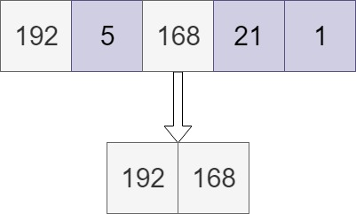
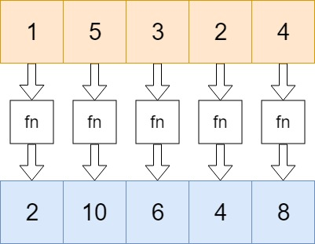
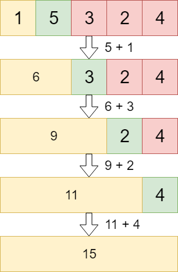

Basic array methods and properties are covered in the last blog. Now, lets look at some advance arrays functions.

There are few prototypes funtions provided

---

## .every()

Checks if every element in an array returns true for a certain condition. Only if the condition returns true for every element in the array, true gets returned.

```javascript
const numbers = [192, 168, 5, 21, 1]
numbers.every(x => x > 2) // false
numbers.every(x => x > 0) // true
numbers.every(x => x < 200) // true
```
***

## .filter()

Creates a new array with all the values for which the condition returns true.

```javascript
const numbers = [192, 5, 168, 21, 1]
var highValues = numbers.filter(x => x > 70) 
// highValues is [192, 168]
```


***

## Array.isArray()
Array.isArray() checks whether the passed parameter is an array or not.

```javascript
const numbers = [192, 5, 168, 21, 1]
const age = 26
const name = 'Mustafa'

Array.isArray(numbers)  
// true. numbers is an array.
Array.isArray(age) 
// false, age is a number, not a array
Array.isArray(name) 
// false, name is a string, not a array
```
***

## .map()
Creates a new array based on the function that’s passed as argument.

```javascript
const numbers = [1, 5, 3, 2, 4]
const newNumbers = numbers.map(x => x * 2);
// [2, 10, 6, 4, 8]

const helloList = numbers.map(() => 'Hello'));
// ["Hello", "Hello", "Hello", "Hello", "Hello]

const smallOrBig = numbers.map(x => {
    return (x <= 2) ? 'small' : 'big'
});
// ["small", "big", "big", "small", 'big']
```



***

## .reduce()
Reduce the values of the elements of an array to a single value (going left-to-right). The reduce method receives at least two arguments: the **accumulator** and the **current** value. When we go over the array, we basically collect the values of each element, and do something with them. The accumulator is the **“accumulated”** value of the elements so far, the current value is the value that’s currently the active element in the array as we’re walking over it. 

Let’s say that we simply want to add both values together, and in the end return the value of all elements summed up.

```javascript
const numbers = [1, 5, 3, 2, 4];
numbers.reduce((acc,cur) => acc + cur); //15
```

Green: current value. Orange: accumulator



Although we are just adding the two values in this example, you can do anything based on the value of the accumulator and current value. The reduce method actually receives two arguments: the callback function, and an optional initial value. In the example above, we didn’t provide an initial value, thus the reduce method started at index 1. The accumulator was equal to the element on index 0.

However, if we add an initial value, the reduce method will start at index 0 and take the initial value as the first accumulator. Example: 

```javascript
const numbers = [1, 5, 3, 2, 4];
numbers.reduce((acc,cur) => acc + cur, 100); //115
```
Although the reduced value of the elements in the array is 46, the initial value of 100 got added too. 

Like stated before, you can do anything with the accumulator and the current value. Let’s say that we have an array of objects instead.  In this case, you must provide an initial value. 

```javascript
const people = [
    { name: 'Mustafa', age: 26 },
    { name: 'Shivam', age: 26 },
    { name: 'Raj', age: 27 }
]

people.reduce((acc, cur) => {
    const key = cur.age
    if(!acc[key]) {
        acc[key] = []
    }
    acc[key].push(cur.name)
    return acc
}, {})

// {
//     26: ['Mustafa', 'Shivam'],
//     27: ['Raj']
// }
```


***

