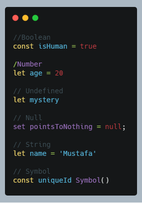
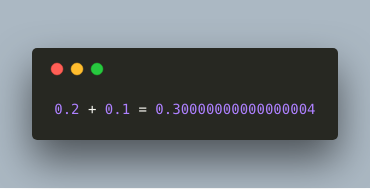
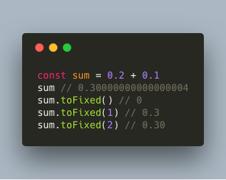
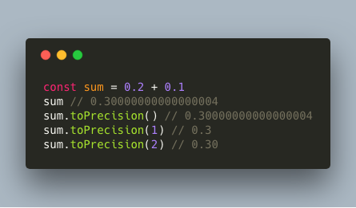
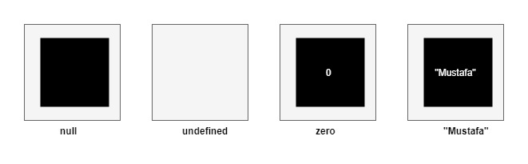
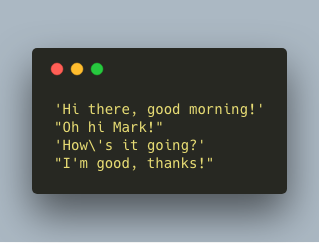

JavaScript has six primitive data types:

***
## Boolean 

A boolean is either true or false: it represents a logical entity. Let’s say it’s important for a feature I’m implemeting to know whether I’m human or not. I can assure you I am (although some of you seem to doubt that…) and I’m also not planning to change that! I use the const keyword to make sure I can never turn into a dog or anything else that isn’t human, and set the isHuman variable to true. 

Booleans can be used for many things, however it basically all comes down to the fact that we can decide whether certain blocks of code or other tasks should get executed based on whether a variable is true or false. 

***

## Number
Represents a floating point number. Okay, what’s a floating point number you might ask, which is a valid question. A floating point numbers are numbers that contain decimals, such as 5.5 or -1.402. However, how come it only represents a floating point number, if the example clearly says the value is equal to 20 (which doesn’t contain decimals, thus looks like an integer)?

In JavaScript, there are always decimals, even if you can’t see them. Yes, really, thank you JavaScript for already starting to get weird!  However, there is one easy way to see them:

As you can see, the floating point arithmetic it’s not always 100% accurate, as we wouldn’t expect that 4 there. But don’t worry, there are ways to make sure the number that’s being returned always has the right amount of decimals with toFixed and toPrecision.

***

## Undefined
A variable that hasn’t been assigned a value yet, or in other words a variable that hasn’t yet been defined, holds the value undefined. We haven’t given the variable a value yet, although we have declared it. 

***

## Null
You can declare a variable with the value null if you deliberately don’t want it to hold any value. Null does not mean 0 or undefined: the variable deliberately points to nothing. As the difference between null, undefined and 0 might be a bit confusing, here’s a quick example:

***

## String
A string represents a sequence of characters. In JavaScript, we can use either a single quote or double quote in order to indicate that the value is a 

The backward slash is required in the third sentence, as we would otherwise terminate the string after “How”, which is not what we want!

***

## Symbol
A symbol is a unique and immutable (it cannot change) value. You can use a symbol in many different ways, but most of the time you’ll use them at places where otherwise you would use a string or a number. Strings and numbers aren’t unique themselves, so if you ever want a value to be globally unique, symbols are the way to go. This will make a lot more sense once we get to functions and objects, don’t worry! 

---